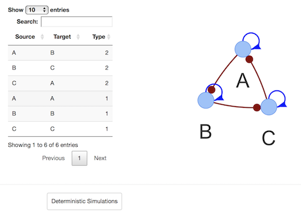
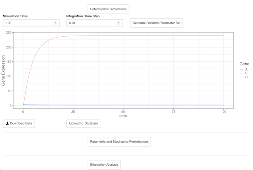

```{r setup, include=FALSE}
knitr::opts_chunk$set(echo = FALSE)
```
# Overview

Gene Circuit Explorer (GeneEx) is a systems-biology tool to visualize and simulate gene regulatory circuits (GRCs). It can simulate a single model with specific kinetic parameters or an ensemble of models using the random circuit perturbation approach with and without stochastic effects (sRACIPE/RACIPE) for a comprehensive understanding of the structure and function of the GRCs in cell populations. The randomization-based methods (RACIPE/sRACIPE) enable study of the effects of both the gene expression noise and the parametric variation on any GRC using only its topology by simulating an ensemble of models with random kinetic parameters at multiple noise levels. Statistical analysis of the generated gene expressions reveal the basin of attraction and stability of various phenotypic states generated by the GRC. Thus, GeneEx provides a holistic picture to evaluate the effects of both the stochastic nature of cellular processes and the parametric variation on GRCs.

GeneEx can also be used inside R by calling sracipeGeneEx function
after installing [sRACIPE R package](https://bioconductor.org/packages/release/bioc/html/sRACIPE.html) from 
BioConductor. Additional tutorials on sRACIPE and GeneEx are available [here](https://github.com/vivekkohar/sRACIPE).


# Citation {#Citation}

If you find this website helpful in your reserach, please consider citing the papers [Interrogating the topological robustness of gene regulatory circuits by randomization](http://journals.plos.org/ploscompbiol/article?rev=2&id=10.1371/journal.pcbi.1005456) published in PLoS computational biology 13 (3), e1005456 and [Role of noise and parametric variation in the dynamics of gene regulatory circuits](https://www.nature.com/articles/s41540-018-0076-x) published in [npj Systems Biology and Applications, 4, 40 (2018)](https://www.nature.com/articles/s41540-018-0076-x).

# Tutorial

## Introduction

GeneEx employs a differential equation based approach to model the genes and their interactions. The dynamics of an isolated gene is modeled using the differential equation $\dot{X_t} = G_X - K_XX_t$ where $X_t$ represents the expression level of a gene at time $t$, $\dot{X}$ represents the rate of change of $X_t$ and $G_X$, $K_X$ are the two parameters representing the production rate and degradation rate of the gene. In this simple case, the steady state is simply the expression level at which $\dot{X}=0$ or $X_s = G/k$. If gene $X$ is regulated by another gene $Y$, then the interaction between them is modeled using the shifted Hill function, $$ H_s(Y_t,T_{YX},N_{YX},\lambda_{YX}) = \lambda + \frac{1-\lambda }{1+\big( \frac{Y_t}{T_{YX}}\big)^{N_{YX}}}$$ where $T_{YX}$ is the threshold of regulation, $N_{YX}$ (integer) is the Hill coefficient of regulation, and $\lambda_{YX}$ is the fold change of the regulation. We multiply the production rate of the gene $X$ by regulation factor given by, $H(Y_t,T_{YX},N_{YX},\lambda_{YX})/\lambda_{YX}$ if the $Y \to X$ regulation is excitatory and $H(Y_t,T_{YX},N_{YX},\frac{1}{\lambda_{YX}})$ if the regulation is inhibitory. If a gene is regulated by multiple genes, then the production rate is multipled by the regulation factor of all the interactions regulating this gene. For example, if gene $X$ in a stochastic environment  with noise level $\eta$ is activated by gene $Y$ and inhibited by gene $Z$, then the stochastic differential equation for $X$ can be written as, 
$$ \dot{X_t} = G_X\frac{H_s(Y_t,T_{YX},N_{YX},\lambda_{YX})}{\lambda_{YX}}H_s(Z_t,T_{ZX},N_{ZX},\frac{1}{\lambda_{ZX}}) -K_XX_t + \eta_t$$ Thus, in this modeling method, there are two parameters for each gene - the production and degradation rate of the gene, and three parameters for each interaction between two gene - the threshold, fold change and Hill coefficient of regulation. For a circuit with $N_g$ genes and $N_{reg}$ regulations, the total number of parameters is $2N_g+3N_{reg}$. Varying these parameters generates different time trajectories and steady state gene expression values. Using [GeneVyuha](#GeneVyuha), one can simulate and visualize a circuit with random parameter values and then interactively change any parameter value and observe the effect on the time trajectory of gene expression values. Further, bifurcation diagrams for any parameter can be plotted and stochastic effects can be incorporated by changing the noise levels.    

In [RACIPE](#RACIPE), we randomize these parameters and by default their values are chosen from a uniform distribution with range $(1,100)$ for the production rate, $(0.1,1)$ for the degradation rate, $(1,100)$ for fold change, and $[1,6]$ for the Hill coefficient of regulation. The range of the thresholds for each interaction is calculated based on the circuit topology. Statistical analysis of gene expression simulation of a large ensemble of models with such randomized parameters yields distinct clusters that resemble typical phenotypic states corresponding to the simulated circuit. For further details, please refer to [Citation](#Citation).  

We are also curating (see [Database](#Database)) simulations of selected circuits demonstrating the utility of GeneEx in generating known time trajectories (steady states or oscillations) and phenotypic clusters for typical circuits. Users can upload their simulated datasets and circuit to the database. 
Note that the uploaded data will not be available in the database immediately
and it will be verified manually to maintain the integrity of the database.

## Circuit {#Circuit}

At the minimum, the GeneEx user needs to provide a cicuit topology mentioning the regulator (source) gene, regulated (target) gene and the type of regulation (acitvation or inhibition). Such topology can be uploaded or the information can be entered in the editable
table. A sample topology file can be downloaded from the 
`Choose Circuit File` section. Below we show the topology file for a toggle switch circuit with two genes, A and B, inhibiting each other.
```
Source Target Type
  A      B    2
  B      A    2
```
After uploading the file, the `Load Circuit` button should be clicked to load the circuit. This will display the topology as a network figure showing the nodes and their interactions. The activation/excitatory interactions are shown in blue with an arrow pointing to the target gene and the inhibitory interactions are shown as red lines with a dot near the target gene. The circuit can be zoomed in or out by scrolling the mouse over it and selecting a gene will highlight all its interactions. Uploading a file automatically populates the table with the circuit topology. The topology can be changed by changing the enteries in this table and clicking the `Load Circuit` button. The modified circuit can be downloaded using the `Download circuit` button. 

[]

## GeneVyuha {#GeneVyuha}

GeneVyuha (Vyuha - a sanskrit origin word meaning pattern/formation) tab can be used to simulate the trajectory/time series of a gene regulatory circuit for a given set of parameters and explore the effect of change in parameter values. 
Initially a random parameter set is generated for the circuit. 
The `Parameter` is a dropdown menu populated by the parameters of the circuit being simulated. It lists the parameters in the follwing order:
 
 *    Production rate of genes 
 *    Degradation rate of genes
 *    Thresholds for the interactions
 *    Hill coefficients of regulation for interactions
 *    Fold change of regulations
 As the production rate (`G`) and degradation rate (`K`) are gene specific parameters, they are indicated by the letter `G_`(`K_`) followed by the gene name. Similarly, as the other parameters are interaction specific, they are labeled as `TH_` (threshold), `N_` (Hill coefficient), and `FC_` (fold change) followed by the name of the source gene and target gene separated  by an underscore. The `Value` is a numeric input to replace the randomly generated value of the parameter.
Every
parameters can be changed by selecting the parameter to be changed from the dropdown menu and modifying its value. Other options for simulations like simulation time,  step size, noise level etc can also be changed. Clicking `Simulate` will 
generate and display the time trajectories of the gene expression values as shown below.
 
 []
 
Clicking the `Randomize Parameters` button will generate a new set of parameter values . 
 Multiple new buttons like `Download Data`, `Upload Options`, `Parametric Perturbations`, etc are visible now. Clicking the `Simulate` button will perform a new simulation of the circuit with these modified parameters. 

Clicking `Parametric Perturbation` button at the bottom will show other inputs like `Parameter`, `Min value`, `Max value`, `Simulation Points`. Here, GeneEx generates a large number of models with parameters used in the previous simulation and selects the value of the parameter selected in the `Parameter` input from a uniform distribution specified by the range (`Min value`, `Max value`). By default, these values are populated by `(0.9P,1.1P)` where `P` denotes the value of the parameter in the previous simulation. All the models are simulated and their final gene expressions are plotted against the selected parameter to generate the parametric perturbation diagram. For a recorded demo, please click on the image below to watch a video on youtube. 

## RACIPE {#RACIPE}

RACIPE (random circuit perturbation) approach generates a large number of models with random parameters to mimic the parameters in a cell population. The models with these parameters are simulated and the final gene expressions obtained for each model are used for further statistical analysis. RACIPE tab shows the statistical behavior of models mimicking a cell population. The data can be filtered for various parameters so that one can observe how a change in parameter value affects the gene expression patterns. For example, limiting the production rate of a gene can be considered as knockdown of that particular gene. sRACIPE (stochastic random circuit perturbation) approach incorporates stochastic effects in the RACIPE approach to better model a cell population. The statistiics are calculated at multiple noise levels using two simulation schemes: (a) constant noise based method which estimates the basin of attraction of various phenotypic states and (b) annelaing based method which provides an estimate of the relative stability of the different phenotypic states. For further details please see [Citation](#Citation).

Once the circuit is successfully loaded, parameters like `Number of Models` representing the models to be simulated for RACIPE, `Parameter Range` representing the range (`1-100`) of parameters with respect to the default range (`100`), `Simulation Time`,  `Integration Time Step` etc. Clicking `Simulate` button will simulate the circuit for specified parameters and display the hierarchical clustering and prinicpal components plots of the simulated gene expressions. Note that the gene expressions are normalized and log transformed for downstream analysis including the clustering analysis. Another button `Parametric Analysis` will be visible now which can be used for studying the effect of parameters on the gene expression clusters. Clicking `Parametric Analysis` will show three inputs `Parameter` with corresponding slider bars `Parameter Range`. These three filters can be used to filter the simulated data for specified range of parameters. Similar to [GeneVyuha](#GeneVyuha), the `Parameter` is a dropdown menu populated by the parameters of the circuit being simulated. It lists the parameters in the follwing order:

1. Production rate of genes 
2. Degradation rate of genes
3. Thresholds for the interactions
4. Hill coefficients of regulation for interactions
5. Fold change of regulations
 
 As the production rate (`G`) and degradation rate (`K`) are gene specific parameters, they are indicated by the letter `G_`(`K_`) followed by the gene name. Similarly, as the other parameters are interaction specific, they are labeled as `TH_` (threshold), `N_` (Hill coefficient), and `FC_` (fold change) followed by the name of the source gene and target gene separated  by an underscore. `Parameter Range` is a two sided slider which will keep only the data for which the value of the specific parameter selected in the corresponding `Parameter` input is within the selected percentage of the range used for the simulations. For example, if the slider positions are at `10` and `50` for a parameter whose values were selected from a range (`1-100`), the filtered data will contain only the models for which the value of selected parameter is in the range (`10-50`). A maximum of three such filters can be applied simultaneously. The hierarchical clustering and principle components plots are redrawn for the filtered data each time any of the slider is moved.
 
 Clicking the `Stochastic RACIPE` button shows the inputs for stochastic simulations. `Stochastic Simulation Type` is two option button with options `Constant Noise` and `Annealing`. With `Constant Noise` simulations are carried out by incoporating stochastic effects whose strength is proportional to the value selected in the `Noise Level` slider. With `Annealing`, the ensemble of models are simulated for a large $(\sim20)$ number of noise levels differing by a small amount. Note that due to large number of simulations in annealing, it can be much slower. Cicking `Perform Stochastic Simuations` will simulate the circuit and display the hierarchical clustering and principle components. 
 
## Database {#Database}

In addition to allowing the users to simulate any gene regulatory circuit, Gene Circuit Explorer keeps a database of circuit simulations for specific cases (for example, published circuits from the literature). The database will be updated  over time to include more circuits. Circuit with `TimeSeries` include the time trajectories for specific model parameters, for example, trajectories for limit cycle oscillations in a three gene circuit. Similarly, `stochastic` circuits have been simulated with non zero noise levels. The database can be searched by circuit name as well as by genes in the circuit. Clicking on the circuit name will plot the data stored in the corresponding circuit. Users can upload their simulated datasets and circuit to the database. Note that the uploaded data will not be available in the database immediately and it will be verified manually to maintain the integrity of the database.
