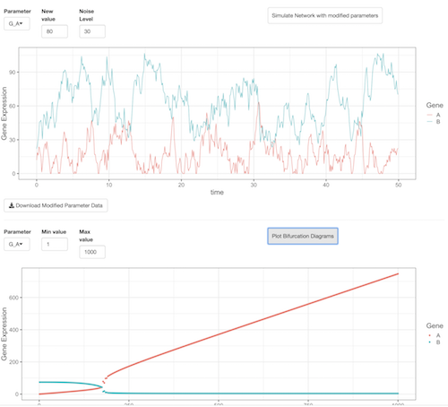
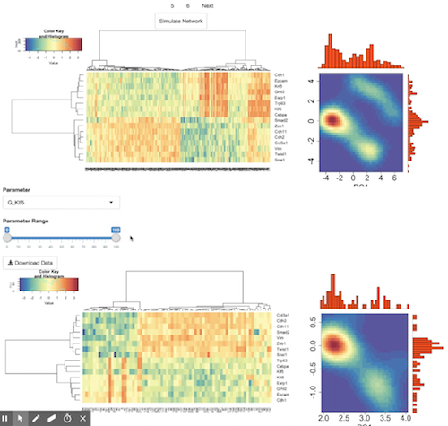
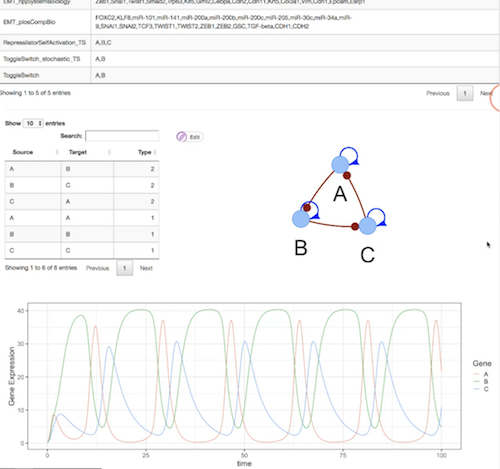

# Gene Circuit Explorer: Visualize, simulate, and analyze gene regulatory networks

  
Gene Circuit Explorer (GeneEx) is a systems-biology tool to visualize and simulate gene regulatory circuits (GRCs). It can simulate a single model with specific kinetic parameters or an ensemble of models using the random circuit perturbation approach with and without stochastic effects (sRACIPE/RACIPE) for a comprehensive understanding of the structure and function of the GRCs in cell populations. The randomization-based methods (RACIPE/sRACIPE) enable study of the effects of both the gene expression noise and the parametric variation on any GRC using only its topology by simulating an ensemble of models with random kinetic parameters at multiple noise levels. Statistical analysis of the generated gene expressions reveal the basin of attraction and stability of various phenotypic states generated by the GRC. Thus, GeneEx provides a holistic picture to evaluate the effects of both the stochastic nature of cellular processes and the parametric variation on GRCs.

GeneEx employs a differential equation based approach to model the genes and their interactions. The dynamics of an isolated gene is modeled using the differential equation $\dot{X(t)} = G - kX(t)$ where $X(t)$ represents the expression level of a gene at time $t$, $\dot{X}$ represents the rate of change of $X(t)$ and $G$, $k$ are the two parameters representing the production rate and degradation rate of the gene. In this simple case, the steady state is simply the expression level at which $\dot{X}=0$ or $X_ss = G/k$. 

If you use this website, please consider citing the papers [Interrogating the topological robustness of gene regulatory circuits by randomization](http://journals.plos.org/ploscompbiol/article?rev=2&id=10.1371/journal.pcbi.1005456) published in PLoS computational biology 13 (3), e1005456 and [Role of noise and parametric variation in the dynamics of gene regulatory circuits](https://www.nature.com/articles/s41540-018-0076-x) published in [npj Systems Biology and Applications, 4, 40 (2018)](https://www.nature.com/articles/s41540-018-0076-x).

# Tutorial

# Using GeneVyuha

GeneVyuha (Vyuha - a sanskrit origin word meaning pattern/formation) tab can be used to simulate the trajectory/time series of a gene regulatory circuit for a given set of parameters and explore the effect of change in parameter values. User can upload a topology and then Gene Circuit Explorer will generate a simulation with some random parameter values. User can modify any or all of these parameters and generate time trajectories with these modified parameter values. Stochastic trajectories can also be generated by changing the noise level (which is set to zero by default).  User can draw bifurcation plots for any parameter to analyze how parameteric variation affects the gene expression patterns. For more details on how to use this tab, please click on the image below to watch a video on youtube.

# Using RACIPE

RACIPE (random circuit perturbation) approach generates a large number of models with random parameters to mimic the parameters in a cell population. The models with these parameters are simulated and the final gene expressions obtained for each model are used for further statistical analysis. RACIPE tab shows these statistical behavior of models mimicking a cell population. The data can be filtered for various parameters so that one can observe how a change in parameter value affects the gene expression patterns. For example, limiting the production rate of a gene can be considered as knockdown of that particular gene. sRACIPE (stochastic random circuit perturbation) approach incorporates stochastic effects in the RACIPE approach to better model a cell population. The statistiics are calculated at multiple noise levels using two simulation schemes: (a) constant noise based method which estimates the basin of attraction of various phenotypic states and (b) annelaing based method which provides an estimate of the relative stability of the different phenotypic states. For more details on how to use RACIPE tab, please click on the image below to watch a video on youtube.

# Using Database

In addition to allowing the users to simulate any gene regulatory network, Gene Circuit Explorer keeps a database of network simulations for specific cases (for example, published networks from the literature). The database will be updated  over time to include more networks. Networks with "_TS" in their name depit the time trajectories for specific model parameters, for example, trajectories for limit cycle oscillations in a three gene network. Similarly, network with "_stochastic" in their name have been simulated with non zero noise levels. The database can be searched by network name as well as by genes in the network. For more details on how to use the database, please click on the image below to watch a video on youtube.

